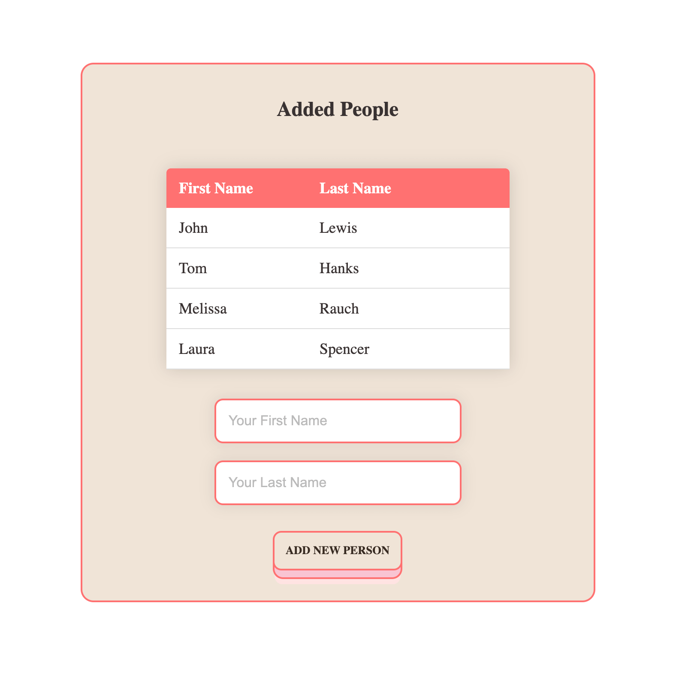

# Persons Table Web App with Form

[See Live Demo :point_right: ](https://july-1390.github.io/table-names/)
This is minimal react web app where you can add new person into the table

## About the project

Web App consist of two components Table and Form

As a user, you can:

:white_check_mark: add a person with a form

:white_check_mark: delete any person

Simple and concise web application design

## Features and frameworks:

- React Hook (useState)
- react-icons

## Contributions

Your contributions are always welcome!
